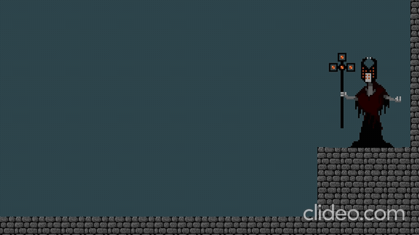

# JavaFX Game Engine Demo

2D action game built with FXGL library for the Object-Oriented Programming (OOP) course at IFRS (Instituto Federal do Rio Grande do Sul) technical program. Created in 2018.

**Official IFRS repository:** https://github.com/IFRS-CampusFarroupilha/jogo_fxgl *(code may be outdated)*

## 🎮 Features
- Player-controlled character with movement and combat mechanics
- Enemy AI system (Light Bandit, Knight, Boss)
- Projectile-based combat (fireball attacks)
- Health and score tracking
- Factory design pattern for entity creation
- Collision detection and physics

## 🛠️ Technologies
- **Java** - Core programming language
- **FXGL** - JavaFX-based game library
- **JavaFX** - UI and graphics framework

## 📦 Project Structure
- `CoelhoAdventure.java` - Main game application
- `PlayerControl.java` - Player movement and actions
- `BolaDeFogoControl.java` - Projectile system
- `CoelhoFactory.java` - Entity factory implementation
- Enemy controllers (LightBandit, Knight, FinalBoss)

## 🎯 Concepts Demonstrated
- Game loop architecture
- Entity-component system
- Collision handling
- Input management
- Resource loading

## 🎓 Academic Context
Developed as a practical project for demonstrating object-oriented programming principles including inheritance, polymorphism, and design patterns in a real-world application.
